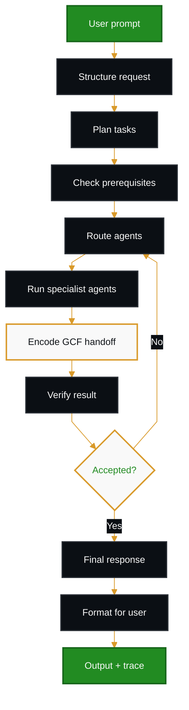
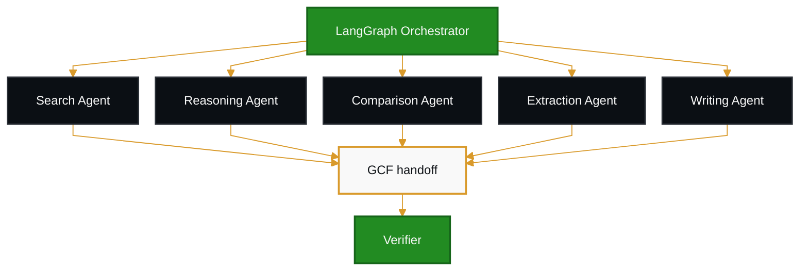
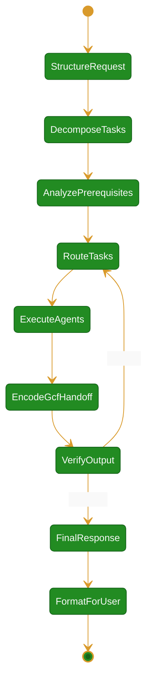
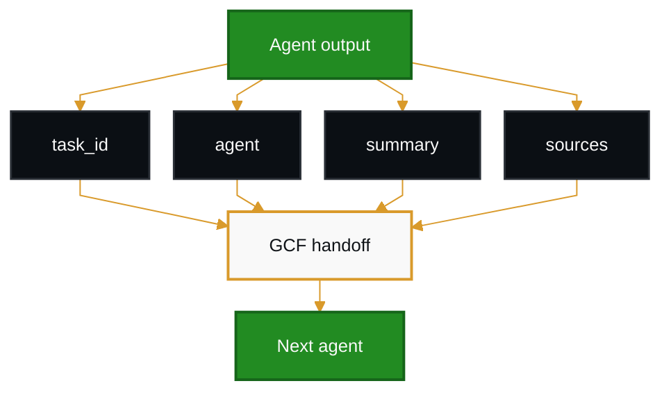
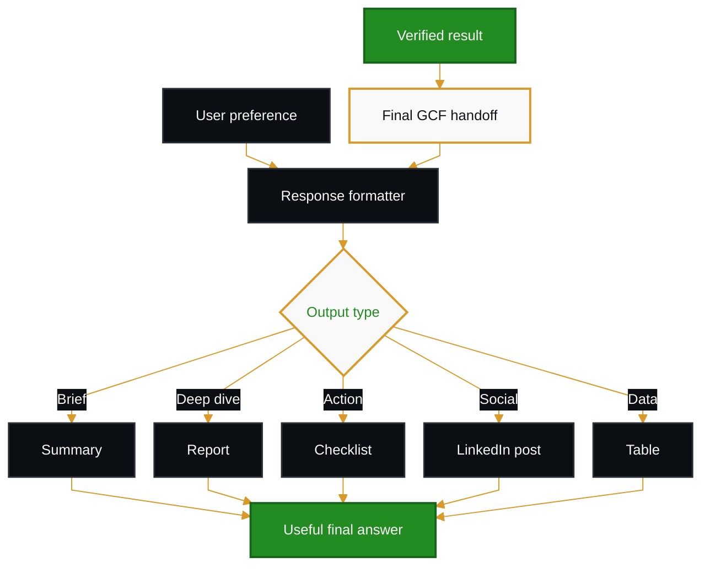
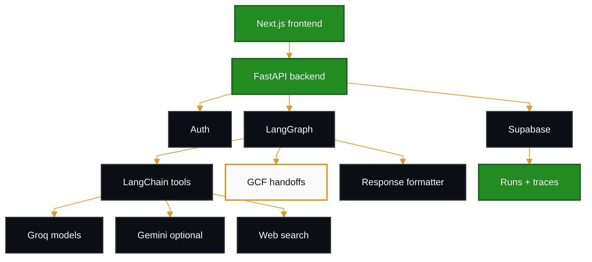
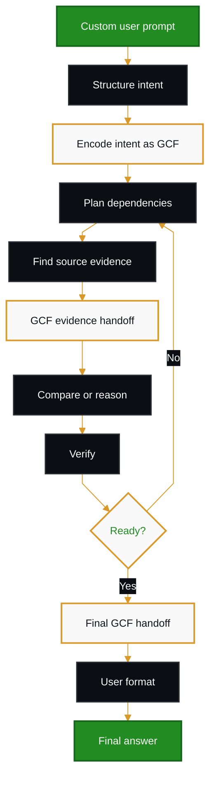

# Agentic AI Workflow Diagrams

These diagrams are designed for README documentation and LinkedIn PDF carousel posts.

Internal agent handoffs use GCF (Graph Compact Format) to reduce prompt tokens while preserving traceability.

## Main Product Workflow

<!-- pagebreak -->

## Agent Routing Layer

<!-- pagebreak -->

## LangGraph State Graph

<!-- pagebreak -->

## Agent Responsibility Map

```mermaid
%%{init: {"theme":"base","flowchart":{"nodeSpacing":18,"rankSpacing":24,"curve":"linear"},"themeVariables":{"fontSize":"13px","background":"#070B10","primaryColor":"#228B22","primaryTextColor":"#F9F9F9","primaryBorderColor":"#16651A","secondaryColor":"#F9F9F9","secondaryTextColor":"#101418","secondaryBorderColor":"#D99A2B","tertiaryColor":"#0B0F14","tertiaryTextColor":"#F9F9F9","tertiaryBorderColor":"#2A2F36","lineColor":"#D99A2B","textColor":"#F9F9F9","edgeLabelBackground":"#0B0F14"}}}%%
flowchart TD
    A["Structuring"] --> A1["Convert prompt into intent"]
    B["Planning"] --> B1["Split into tasks"]
    C["Prerequisites"] --> C1["Order dependencies"]
    D["Orchestrator"] --> D1["Choose next agent"]
    E["Specialists"] --> E1["Search, reason, compare, extract, write"]
    F["GCF Encoder"] --> F1["Compress handoffs"]
    G["Verifier"] --> G1["Check completeness"]
    H["Formatter"] --> H1["Match user response style"]

    classDef primary fill:#228B22,stroke:#16651A,color:#F9F9F9,stroke-width:2px;
    classDef dark fill:#0B0F14,stroke:#2A2F36,color:#F9F9F9,stroke-width:1.5px;
    classDef gcf fill:#F9F9F9,stroke:#D99A2B,color:#101418,stroke-width:2px;

    class A,B,C,D,E,G,H primary;
    class A1,B1,C1,D1,E1,G1,H1 dark;
    class F gcf;
    class F1 dark;
```

<!-- pagebreak -->

## GCF Agent Handoff Flow

<!-- pagebreak -->

## GCF Payload Shape

<!-- pagebreak -->

## User-Preferred Response Layer

<!-- pagebreak -->

## Response Quality Loop

<!-- pagebreak -->

## Tech Architecture

<!-- pagebreak -->

## Example Flow

