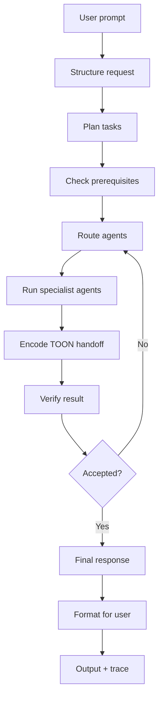
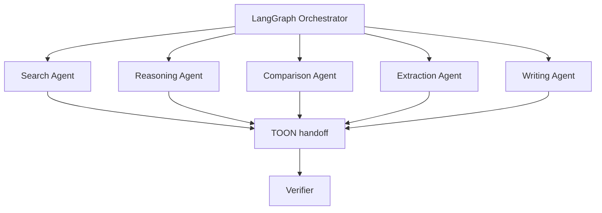
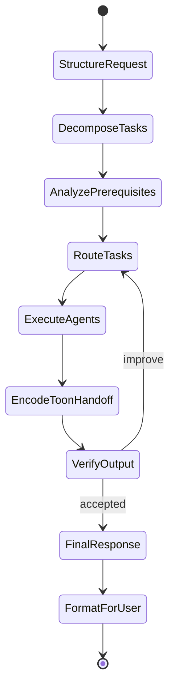
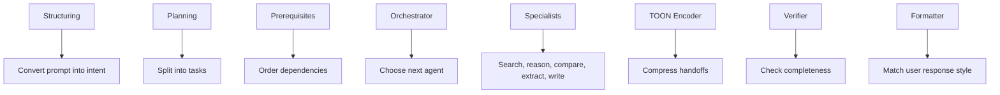
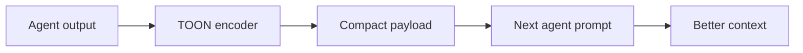
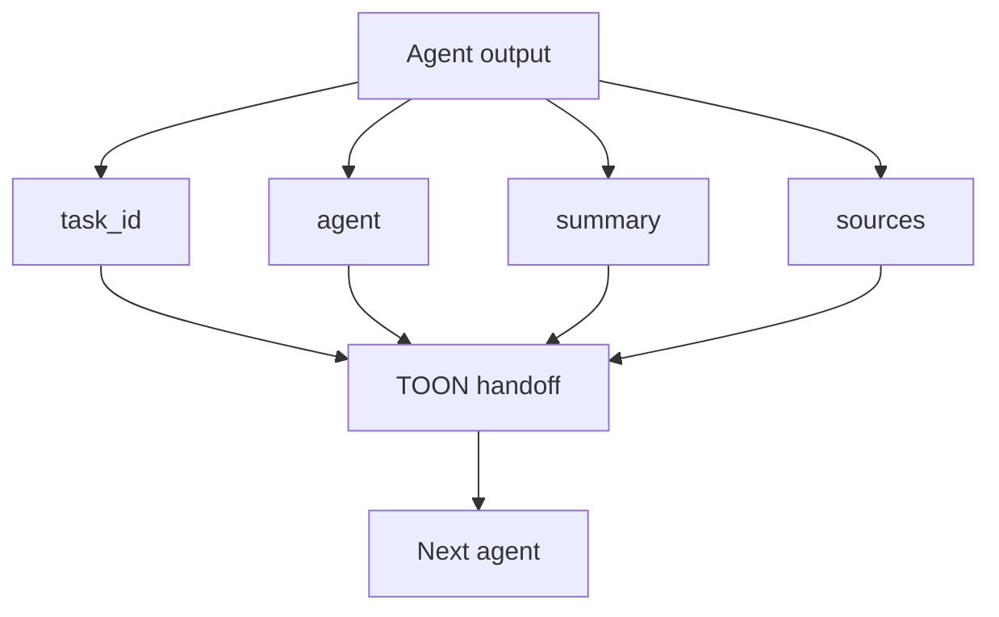
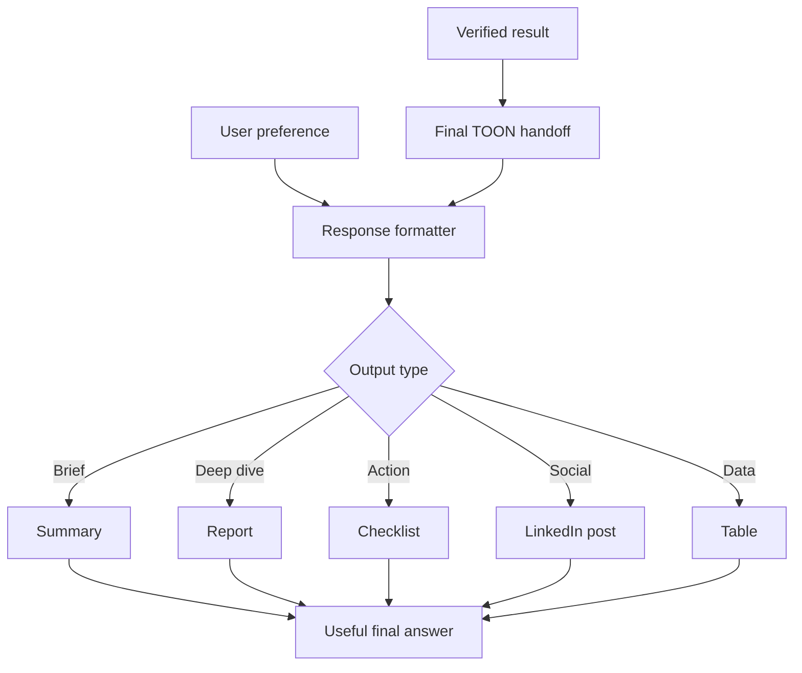
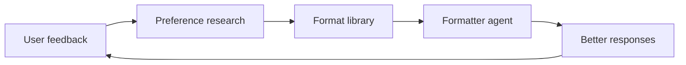
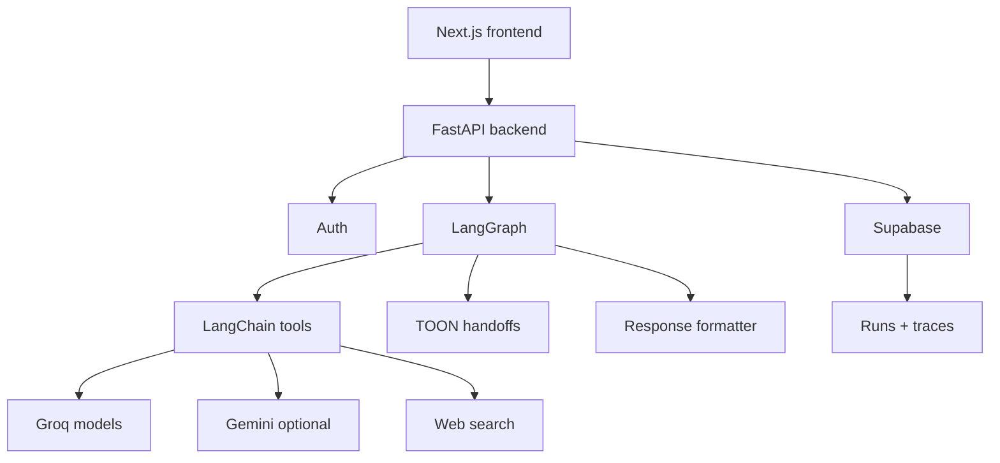
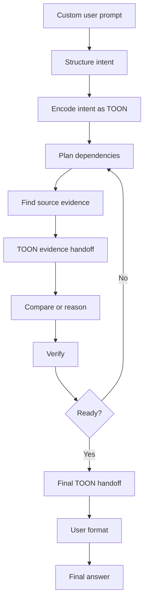

# Agentic AI Workflow Diagrams

These diagrams are designed for README documentation and LinkedIn PDF carousel posts. Each section is kept to one export page so the rendered PDF does not cut diagrams in half.

Internal agent handoffs use TOON (Token-Oriented Object Notation) to reduce prompt tokens while preserving traceability.

## Main Product Workflow

## Agent Routing Layer

## LangGraph State Graph

## Agent Responsibility Map

## TOON Agent Handoff Flow

## TOON Payload Shape

## User-Preferred Response Layer

## Response Quality Loop

## Tech Architecture

## Example Flow

