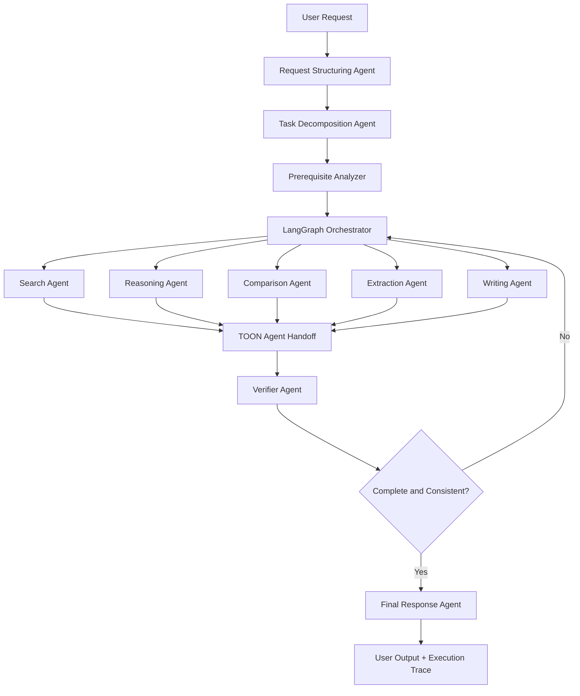
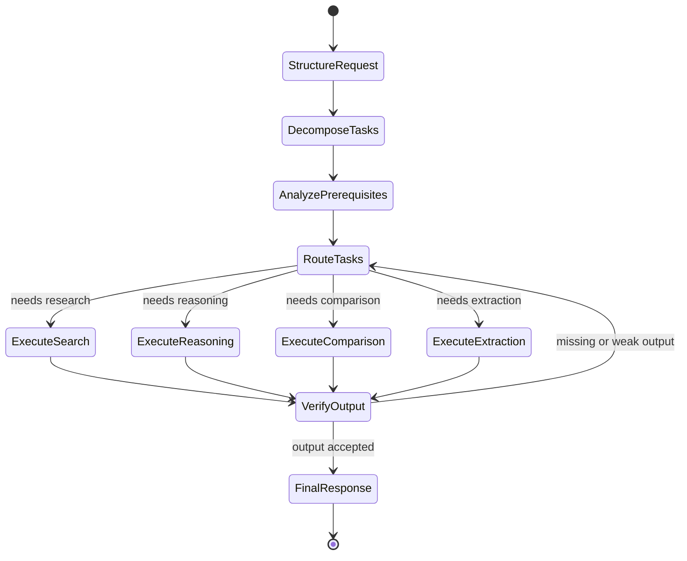
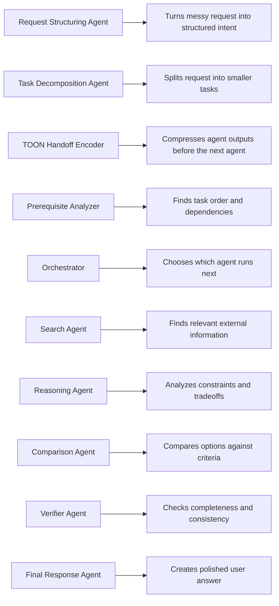
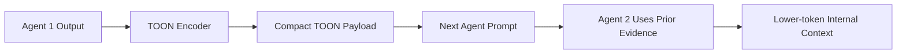
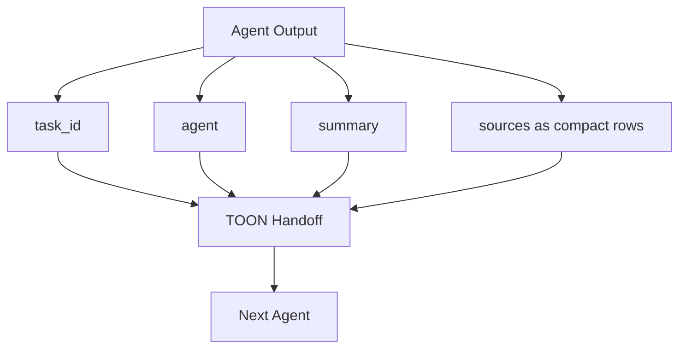
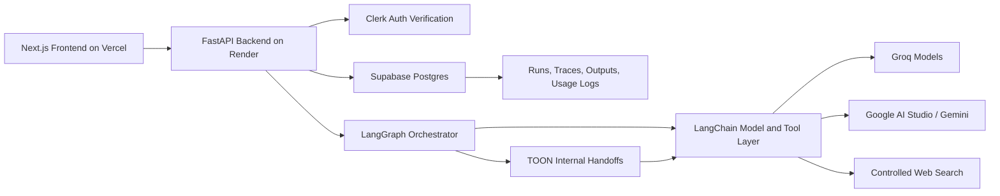
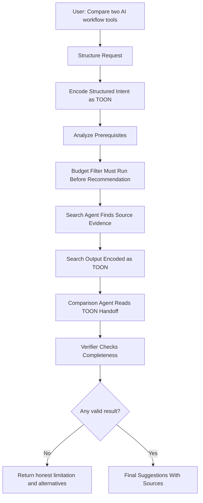

# Agentic AI Workflow Diagrams

These diagrams are designed for README documentation and LinkedIn posts. Internal agent handoffs use TOON (Token-Oriented Object Notation) to reduce prompt tokens while preserving traceability.

## Main Product Workflow

## LangGraph State Graph

## Agent Responsibility Map

## TOON Agent Handoff Flow

## TOON Payload Shape

## Tech Architecture

## Example Flow: Compare AI Workflow Tools

