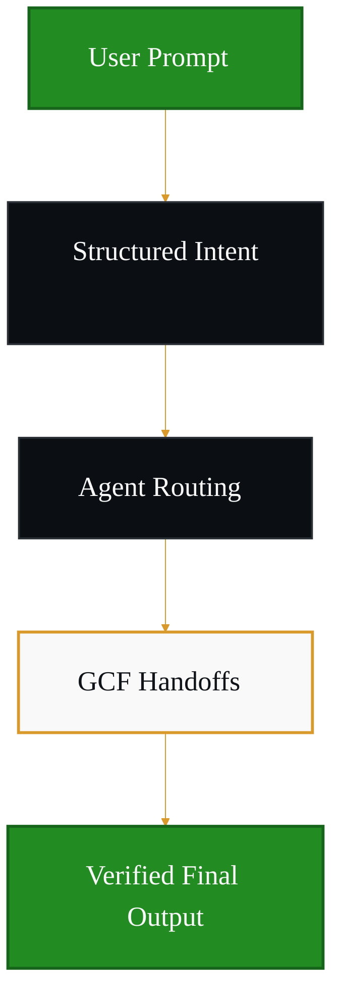
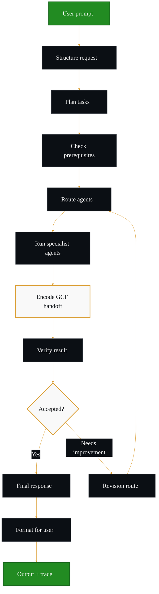
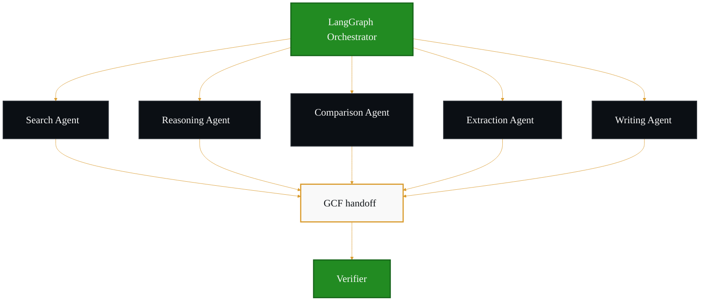
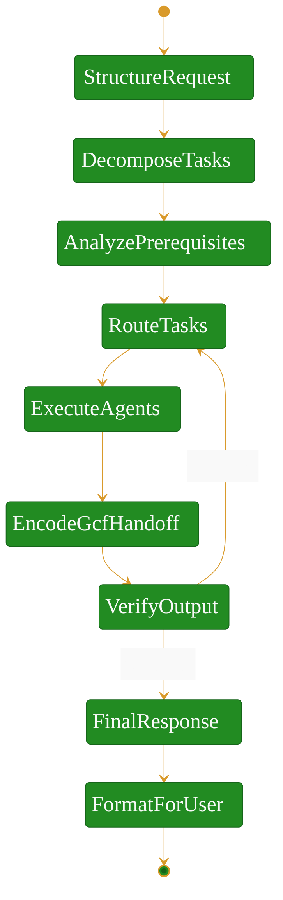
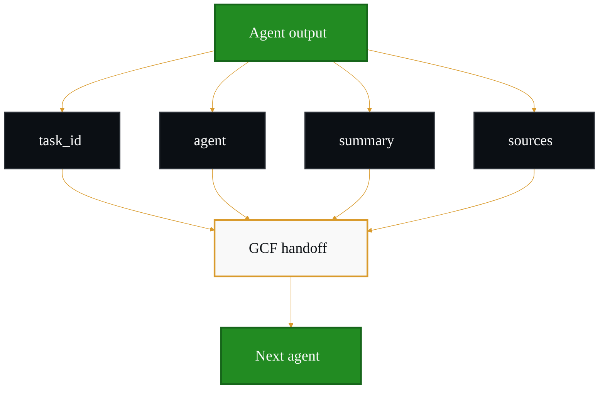
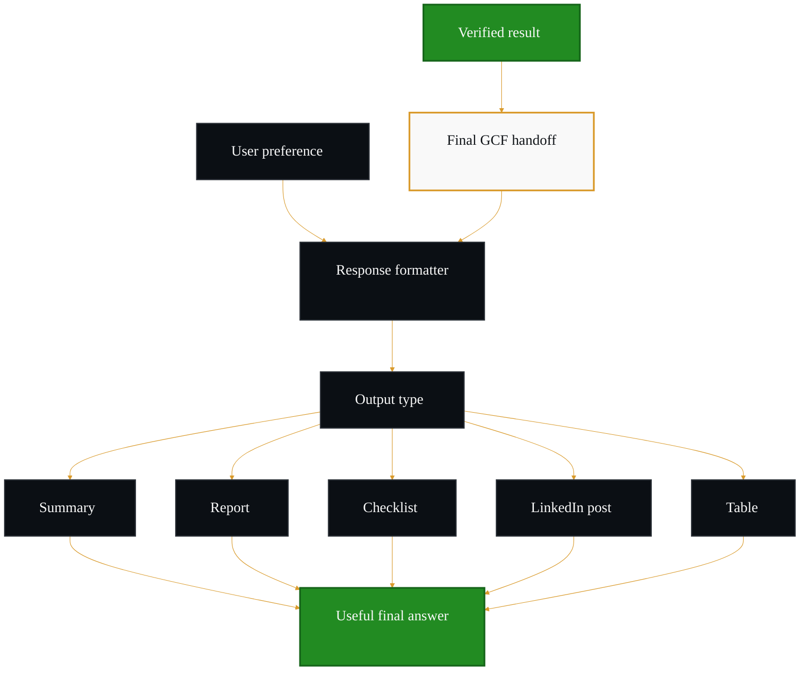
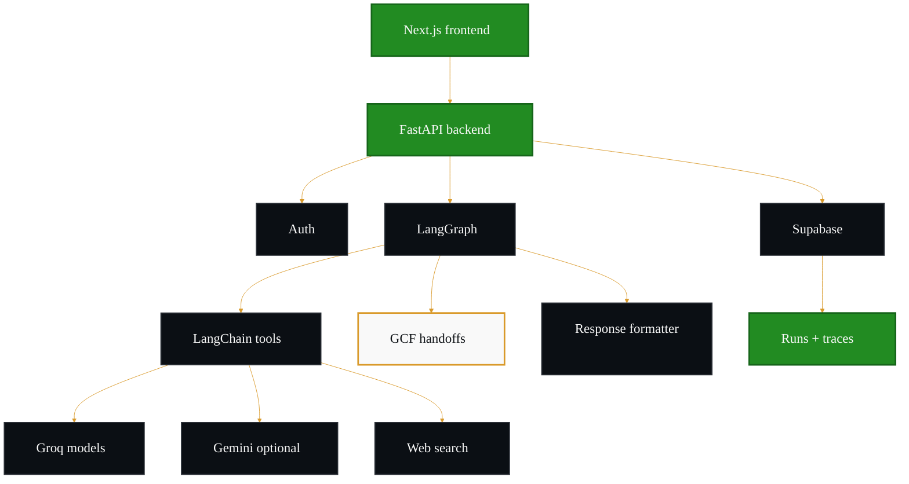
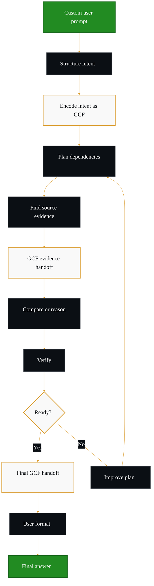

# Agentic AI Workflow Carousel

## Agentic AI Workflow Orchestration

A multi-agent platform where one user prompt becomes a structured workflow, specialist agents execute the right steps, GCF keeps handoffs compact, and the final answer remains traceable.

## Main Product Workflow

This version avoids crossing arrows by keeping the core workflow vertical and showing revision as a clean side loop.

## Agent Routing Layer

## LangGraph State Graph

## Agent Responsibility Map

```mermaid
%%{init: {"theme":"base","flowchart":{"nodeSpacing":70,"rankSpacing":85,"curve":"basis","padding":30},"themeVariables":{"fontFamily":"Inter, Arial, sans-serif","fontSize":"25px","background":"#070B10","primaryColor":"#228B22","primaryTextColor":"#F9F9F9","primaryBorderColor":"#16651A","secondaryColor":"#F9F9F9","secondaryTextColor":"#101418","secondaryBorderColor":"#D99A2B","tertiaryColor":"#0B0F14","tertiaryTextColor":"#F9F9F9","tertiaryBorderColor":"#2A2F36","lineColor":"#D99A2B","textColor":"#F9F9F9","edgeLabelBackground":"#0B0F14"}}}%%
flowchart TD
    A["Structuring"] --> A1["Convert prompt into intent"]
    B["Planning"] --> B1["Split into tasks"]
    C["Prerequisites"] --> C1["Order dependencies"]
    D["Orchestrator"] --> D1["Choose next agent"]
    E["Specialists"] --> E1["Search, reason, compare, extract, write"]
    F["GCF Encoder"] --> F1["Compress handoffs"]
    G["Verifier"] --> G1["Check completeness"]
    H["Formatter"] --> H1["Match user response style"]

    classDef green fill:#228B22,stroke:#16651A,color:#F9F9F9,stroke-width:3px;
    classDef dark fill:#0B0F14,stroke:#2A2F36,color:#F9F9F9,stroke-width:2px;
    classDef gcf fill:#F9F9F9,stroke:#D99A2B,color:#101418,stroke-width:3px;

    class A,B,C,D,E,G,H green;
    class A1,B1,C1,D1,E1,F1,G1,H1 dark;
    class F gcf;
```

## GCF Agent Handoff Flow

## GCF Payload Shape

## User-Preferred Response Layer

## Tech Architecture

## Example Flow

